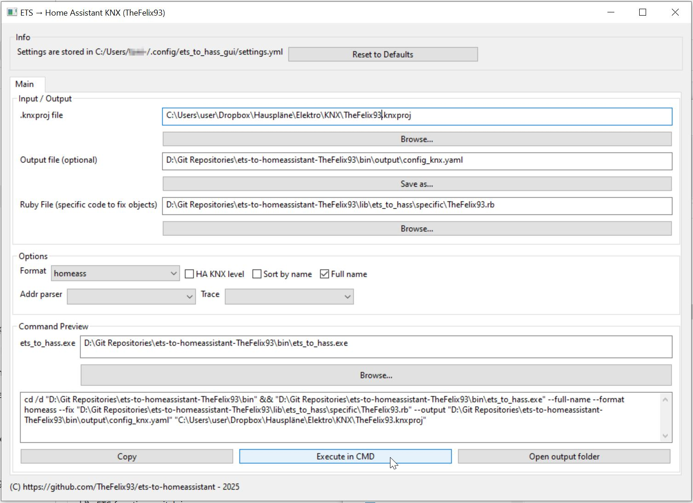

# TheFelix93.rb Custom method for ets-to-homeassistant from Martin Laurent.

## Now with GUI and prebuilt .exe files to enable usage without Ruby dev-env on windows.
Important: Download the whole repository, because all files and the folder structure is needed. Just download whole repo as zip and extract it where you want.
Exe files can be found in "/bin". If you want to execute the command out of the GUI the prebuilt ets_to_hass.exe is required and that you run the EtsToHassTheFelix93GUI.exe from the bin folder, to have all needed relative paths.


* Currently used/implemented ETS-functions:
   * switchable_light
      * On/Off
	* dimmable_light
      * Dimmable
      * RGB
      * CCT/tunable white
	* sun_protection
      * standard covers
      * shutters with angle-settings
	* custom
      * binary sensors (e.g. reed contacts, presence or any true/false GA),
	   * sensors (DPT-to-HA-Sensor-Type mapping table from documentation is used see https://www.home-assistant.io/integrations/knx/#value-types),
      * switches
      * [NEW] climate
      * [NEW] Number new domain number (https://www.home-assistant.io/integrations/knx/#number). Optional: Specific settings like min, max, step can be set manually in yaml output, because there are to many usecases.
	* [NEW] Deactivated functions, to skip ETS functions that might exist because of other reasons (I am open for improvements for your usecases, if you want to skip a function without changing the function name its technically possible, but was not relevant for my usecases.)

This script uses ETS-Function-name-patterns to identify the function types and middle-group or any GA-Pattern to map GAs to HA specific attributes.
These patterns can be configured to your needs. Any pattern must be unique in its own context.

# Who can use
* KNX integrators and end-users with access to the ETS project and knowledge about using ETS.
* Small to no knowledge of programming to change the script settings
* Small knowledge of command line usage, to run the script and read the output log.
* Ruby development environment
* Just read the how to!

## How to use
1. Follow installation instructions of original repository: [https://github.com/laurent-martin/ets-to-homeassistant](https://github.com/laurent-martin/ets-to-homeassistant)
2. Make sure all devices that you want in HA are available as ETS functions in your ETS project. See [ETS functions project requirements/recommendations](#ets-functions-project-requirementsrecommendations)
3. Adapt script settings to your ETS project see [Settings inside TheFelix93.rb](#settings-inside-thefelix93rb)
4. Execute main script
   
   Adapt the paths in the command to your environment. I recommend using absolute paths. Its less error prone:
   ```bash
   ets_to_hass --format homeass --full-name --fix YOUR_SCRIPT_PATH\lib\ets_to_hass\specific\TheFelix93.rb --output YOUR_OUTPUT_PATH\config_knx.yaml YOUR_ETS_PROJECT_PATH\myexport.knxproj
   ```
6. Check the output to identify missconfigurations in your ETS project and functions.
   All warnings from my custom method start with "TheFelix93" e.g. `WARN -- : TheFelix93 Ankleide FB Heizung function type heating_floor not implemented.`
7. Import output yaml into home assistant. Enjoy.

## Possible output YAML
[examples/TheFelix93_result.yaml](examples/TheFelix93_result.yaml)

## ETS functions project requirements/recommendations

* According to some reports in original project. The parser can't process password protected ETS projects. My project is not protected, so did not test it.
* Every GA that you want to get in KNX yaml config must be grouped into ETS-Functions. (Nobody can guess which GAs belong together. ETS Functions are used to create relations between GAs, that are very similar to HA entities.)
* The script requires unique text patterns in function names, so create your ETS function structure accordingly.
* The script requires unique GA-patterns to correctly map all sorts of HA-KNX attributes. I use **function/sub-function/channel-name** and script settings are set accordingly. Other schemes work as well, you just need to changes the script settings to fit your system.
* A building structure in ETS project is recommended. It makes it easy to identify HA entities laters. I like to have function name, room and floor as part of the entity name.

Examples from my ETS project:
* ETS building structure and  ETS example room

   
   
 
* Deactivated ETS function (use it to let the script ignore the ETS function)

   
  
* ETS function CCT light
  
   
* ETS function RGB light
  

* ETS function dimmable light


* ETS function sensor current
  

* ETS function sensor temperature
  

* ETS function shutter
  

* ETS function standard cover
  

* ETS function switch
  

* ETS function switchable light
  


* ETS function climate


* ETS function numeric value: no screenshot available
```
number:
- name: Input Lüftungsvoreinstellung Lüftung Zentral
  type: pulse
  address: 24/1/2
  state_address: 24/1/1
```
   
## Settings inside TheFelix93.rb
TheFelix93.rb starts with a settings section.

All patterns are case-in-sensitive.
```ruby
#### GENERAL ####
ENTITY_NAME_WITH_FLOOR = true # if true and a function lies below a floor, the floor name is appended to the HA entity name

SKIP_PATTERN = 'deactivated'


CLIMATE_TEMP_STEP = 0.5 # Defines the step size in Kelvin for each step of setpoint_shift (scale factor). For non setpoint-shift configurations this is used to set the step of temperature sliders in UI.
CLIMATE_SHIFT_POINT_MODE = 'DPT9002'

SENSOR_SYNC_STATE = true # can be used to change default sync state setting for binary sensors, see HA KNX docu.


#### Lights #####
# DPT 7.600 in Lights can be 'color_temperature_state_address' or 'color_temperature_address', thus we need a criteria to decide.
# In my ETS project I have a GAs with middle groups that are unique for each function
GA_MIDDLE_GROUP_PATTERN_BRIGHTNESS_SET = '/3/'
GA_MIDDLE_GROUP_PATTERN_BRIGHTNESS_STATUS = '/6/'

## CCT ##
GA_MIDDLE_GROUP_PATTERN_COLOR_TEMP_SET = '/5/'
GA_MIDDLE_GROUP_PATTERN_COLOR_TEMP_STATUS = '/7/'

## RGB ##
GA_MIDDLE_GROUP_PATTERN_RGBCOLOR_SET = '/7/'
GA_MIDDLE_GROUP_PATTERN_RGBCOLOR_STATUS = '/5/'

#### Covers ####
GA_MIDDLE_GROUP_PATTERN_COVER_UP_DOWN = '/0/' # To enable up/down arrows in HA. I have to put my middle group here to distinguish between up/down and current-direction GA. Both have the same DPT.
GA_MIDDLE_GROUP_PATTERN_COVER_POSITION_STATUS = '/4/'
GA_MIDDLE_GROUP_PATTERN_COVER_POSITION_SET = '/3/'
GA_MIDDLE_GROUP_PATTERN_COVER_ANGLE_SET = '/5/'
GA_MIDDLE_GROUP_PATTERN_COVER_ANGLE_STATUS = '/6/'

### Climate ###
GA_MIDDLE_GROUP_PATTERN_CURRENT_TEMP = '/0/'
GA_MIDDLE_GROUP_PATTERN_TARGET_TEMP = '/1/'
GA_MIDDLE_GROUP_PATTERN_OPERATION_MODE_SET = '/5/'
GA_MIDDLE_GROUP_PATTERN_OPERATION_MODE_STATUS = '/6/'


#### Sensors ####
#I name all my sensors like "*Sensor*" in :custom ets functions. This name pattern is used by the script to distinguish them from other custom functions.
#string must be part of ets function name
PATTERN_SENSOR = 'sensor'

## patterns to map HA device classes tell HA the type of binary sensor
#string must be part of ets function name
PATTERN_PRESENCE_SENSOR = 'präsenz'
PATTERN_WINDOW_CONTACT = 'fensterkontakt'
PATTERN_WINDALARM_SENSOR = 'windalarm'


#### Switches ####
# If non of the sensor patterns matched then the custom function must be a switch.
#string must be part of ets function name
PATTERN_SWITCH = nil # if you define a switch pattern, then only matches are added as switches to output yaml. With nil set, all remaining custom functions are considered as switches.
```

# END OF README - TheFelix93.rb Custom method for ets-to-homeassistant
All from here is original readme.

# ETS project file to Home Assistant configuration

A Ruby tool to convert an ETS5 project file (`*.knxproj`) into:

* a YAML configuration file suitable for **Home Assistant** (requires to define building, functions and group data points in ETS)
* an XML file for `linknx` (the object list only)

[https://www.home-assistant.io/integrations/knx/](https://www.home-assistant.io/integrations/knx/)

## Glossary

* **KNX Group Address**: a group address is a 1, 2 or 3-level address in the KNX system, e.g. `1/2/3`.
* **KNX Data Point Type**: a data point type is a type of data that can be sent on a group address, e.g. **1.001**, **5.001**.
* **ETS Building Information**: In ETS, a building is a container for rooms and **ETS Function**.
* **ETS Function** : In ETS, represents an object that has several **KNX Group Address** associated to it.
* **HA Device** : In Home Assistant, a device has a type (e.g.`light`) and has **HA Config Variable**.
* **HA Config Variable** : In Home Assistant, it's a property of a device, e.g.`name`,`address`,`state_address`.

## Important note

In order for the tool to generate result properly read the following.

An actionable entity in KNX is a **KNX Group Address**: commands are exchanged in a group address on the KNX Bus.
For example a dimmable light has at least one group address for On/Off and another for the dimming value.

An actionable entity in **Home Assistant** is an **HA Device**.
For example, a dimmable light is a device and has properties, one of them is the group address for On/Off and another is the group address for the dimming value.

So, for this tool to work, the following pieces of information must be found:

* **KNX Group Address**
* The purpose for each **KNX Group Address** (typically, a **KNX Data Point Type**)
* Grouping of group addresses into devices : e.g. **ETS Function** in ETS mapped to **HA Device** in Home Assistant

By default, and in fact in a lot of ETS projects, only group addresses are defined as this is sufficient for an installation.
I.e. no **ETS Function** is defined, and **KNX Data Point Type**s are not defined for group addresses.
This is why this tool will not work out of the box most of the times: missing information.
The next 2 sections explain how to fix this.

### Group address: Type

**KNX Group Address**es are defined in the ETS project file naturally, as it is the base for the system to work.
But we need the types of them (e.g. **on/off** versus **dim value**) in order to create the HA configuration.

The best, easiest and most reliable way for the tool to find the type of **KNX Group Address** is to specify the **KNX Data Point Type** in the **KNX Group Address** itself in ETS.
This requires editing the KNX project.
Refer to [Structure in ETS](#structure-in-ets).

Another possibility is to create a custom script.
Refer to [Custom method](#custom-method)

### Group address: Grouping into devices

The second part is to regroup **KNX Group Address**es into **HA Device**.
This is best done by creating **ETS Function** in ETS.
Refer to [Structure in ETS](#structure-in-ets).

Another possibility is to create a custom script.
Refer to [Custom method](#custom-method)

## Installation

1. [Install Ruby for your platform](https://www.ruby-lang.org/fr/downloads/):

    * Windows: [Ruby Installer](https://rubyinstaller.org/)
    * macOS: builtin, or [RVM](https://rvm.io/), or [brew](https://brew.sh/), or [rbenv](https://github.com/rbenv/rbenv)
    * Linux: builtin (yum, apt), or [RVM](https://rvm.io/), or [rbenv](https://github.com/rbenv/rbenv)

2. Install this gem

    ```bash
    gem install ets-to-homeassistant
    ```

3. Test it works:
  
      ```bash
      ets_to_hass --help
      ```

## Usage

General invocation syntax:

```bash
Usage: .ets_to_hass [options] <ets project file>.knxproj

    -h, --help
      show help

    --ha-knx
      include level knx in output file

    --sort-by-name
      sort arrays by name

    --full-name
      add room name in object name

    --format [format]
      one of homeass|linknx

    --fix [ruby file]
      file with specific code to fix objects

    --addr [addr]
      one of Free, TwoLevel, ThreeLevel

    --trace [trace]
      one of debug, info, warn, error

    --output [file]
      add room name in object name```

For example to generate the home assistant KNX configuration from the exported ETS project: `myexport.knxproj`

```bash
ets_to_hass --full-name --format homeass --output config_knx.yaml myexport.knxproj
```

Option `--ha-knx` adds the dictionary key `knx` in the generated Home Assistant configuration so that it can be copy/paste in `configuration.yaml`.
Else, typically, include the generated entities in a separate file like this:

```yaml
knx: !include config_knx.yaml
```

If option `--fix` with a path to a non-existing file, then the tool will create a template file with the default code.
It will generate basic Objects/Functions for group addresses not part of a function.

Logs are sent to STDERR.

## Internal logic

The tool takes the exported file from ETS with extension: `knxproj`.
The project file is a zip with several XML files in it.
Make sure that the project file is not password protected.

* The tool parses the first project file found.
* It extracts **ETS Building Information** and **KNX Group Address**es.
* A Ruby object of type: `EtsToHass` is created, with the following fields:

  `@groups_addresses` contains all **KNX Group Address**es, `_gaid_` is the internal identifier of the **KNX Group Address** in ETS

  `@objects` contains all **ETS Function**, `_obid_` is the internal identifier of the **ETS Function** in ETS

```ruby
@groups_addresses = {
  _gaid_ => {
   name:             "from ETS",
   description:      "from ETS",
   address:          group address as string. e.g. "x/y/z" depending on project style,
   datapoint:        datapoint type as string "x.abc", e.g. 1.001,
   ha:               {address_type: '...' } # set by specific code, HA parameter for address
  },...
}
@objects = {
  _obid_ => {
   name:   "from ETS, either function name or full name with room if option --full-name is used",
   type:   "ETS function type, see below",
   floor:  "from ETS",
   room:   "from ETS",
   ha:     {domain: '...', ha parameters... } # set by specific code, HA parameters
  },...
 }
@associations = [[_gaid_,_obid_],...]
```

* a default mapping is proposed in methods:
  
  * `map_ets_datapoint_to_ha_address_type` : default value for `@group_addresses[x][:ha][:address_type]`
  * `map_ets_function_to_ha_object_category` : default value for `@objects[x][:ha][:domain]`

* the custom specific code is called giving an opportunity to modify this structure.

* Eventually, the HA configuration is generated

## Structure in ETS

The **KNX Data Point Type** of **KNX Group Address** is used to find out the associated **HA Config Variable**.
In ETS, for each **KNX Group Address**, make sure to define the **KNX Data Point Type** as in the following screenshot:


**ETS Building Information** and **ETS Function** are used to generate HA devices.
If the ETS project has no **ETS Building Information**, then the tool will create one **HA Device** per **KNX Group Address**.

In the following screenshot, note that both **KNX Group Address** and **ETS Function** are created.


Moreover, if **ETS Function** are located properly in **ETS Building Information** levels and rooms, the tool will read this information.

When **ETS Function** are found, the tool will populate the `@objects` `Hash`.

The type of **ETS Function** is identified by a name (in ETS project file it is `FT-[n]`):

* `:custom`
* `:switchable_light`
* `:dimmable_light`
* `:sun_protection`
* `:heating_radiator`
* `:heating_floor`
* `:heating_switching_variable`
* `:heating_continuous_variable`

## Custom method

If the **KNX Data Point Type** of a **KNX Group Address** is not defined in the ETS project, then the tool cannot guess which group address is e.g. for On/Off, or for dimming value.

If no **ETS Building Information** with **ETS Function** was created in the project, then the tool cannot guess which set of **KNX Group Address** refer to the same **HA Device**.

It is possible to add this information using option `--fix` (custom script) which can add missing information, based, for example, on the name of the **KNX Group Address**.

For example, I used to use a naming convention like: `<room>:<object>:<type>` before using ETS features, and the custom script could guess the missing data type from `<type>`, and then group addresses into devices based on `<room>` and `<object>`.

But if the convention is to place `ON/OFF` in `1/x/x` then you can use the first address identifier to guess the type of **KNX Group Address**.

The specific code can modify the analyzed structure:

* It can delete objects, or create objects.
* It can add fields in the `:ha` properties:

  * in `@group_addresses`:
    * `address_type` : define the use for the group address, e.g. `address`, `state_address`, etc...
  * in `@objects`:
    * `domain` : set the entity type in HA (`switch`, `light`, etc), this key is then removed from the `Hash`
    * **Other fields** : initialize the HA object with these values, e.g. `name`

The function can use any information such as fields of the object, or description or name of group address for that.

Typically, the name of group addresses can be used if a specific naming convention was used.
Or, if group addresses were defined using a specific convention: for example in a/b/c a is the type of action, b is the identifier of device...

The specific code shall be like this:

```ruby
def fix_objects(generator)
  # use methods of generator to modify the structure
end
```

## Linknx

`linknx` does not have an object concept, and needs only group addresses.

## XKNX

Support is dropped for the moment, until needed, but it is close enough to HA.

## Reporting issues

Include the version of ETS used and logs.

## TODO

One possibility would be to add extra information in the description of the group address and/or function in ETS, and then parse it in the tool.
For example, as YAML format.
